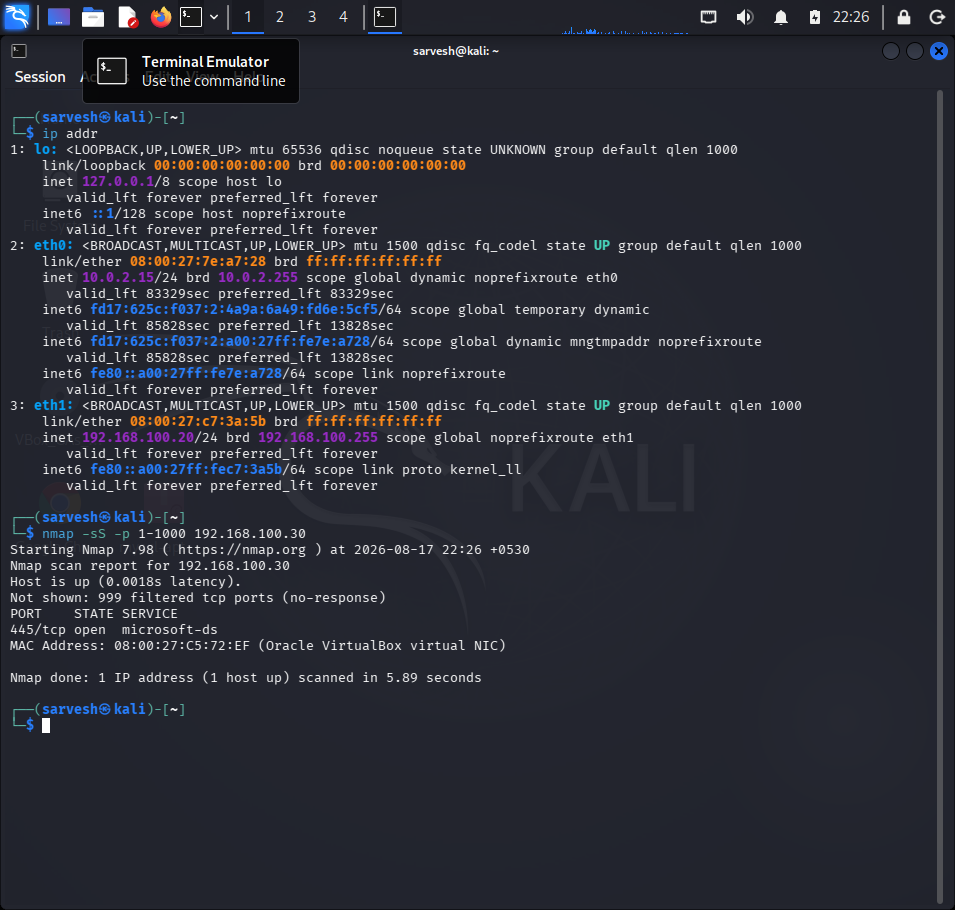
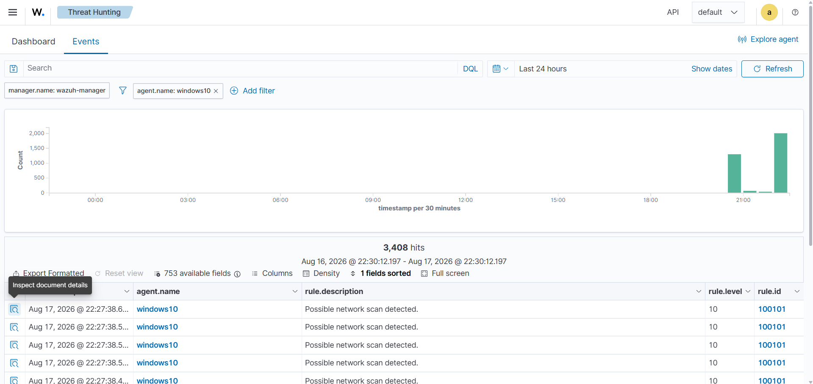
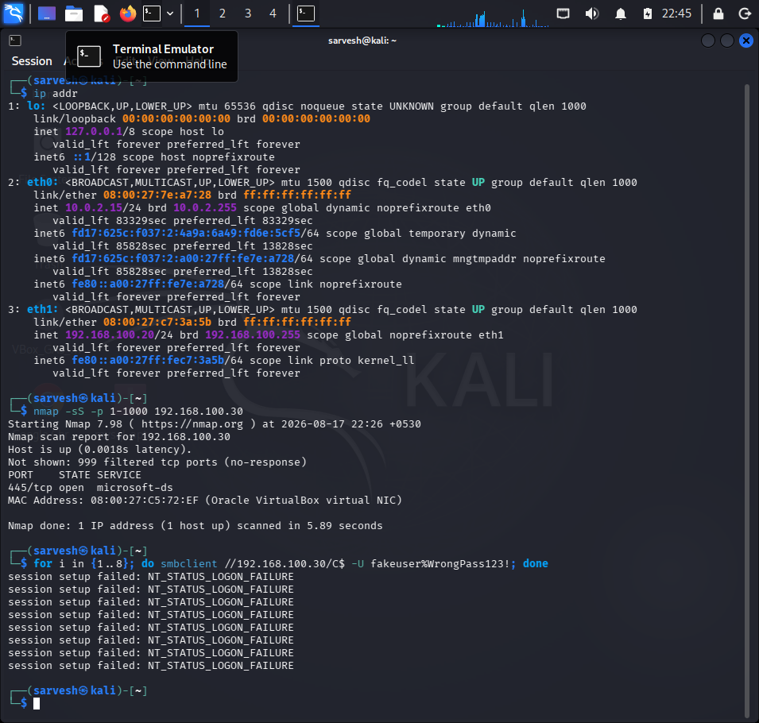
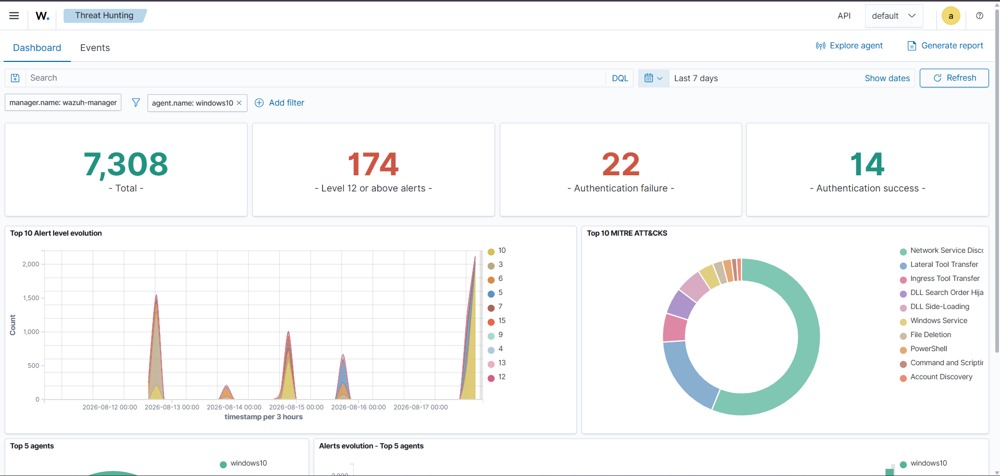
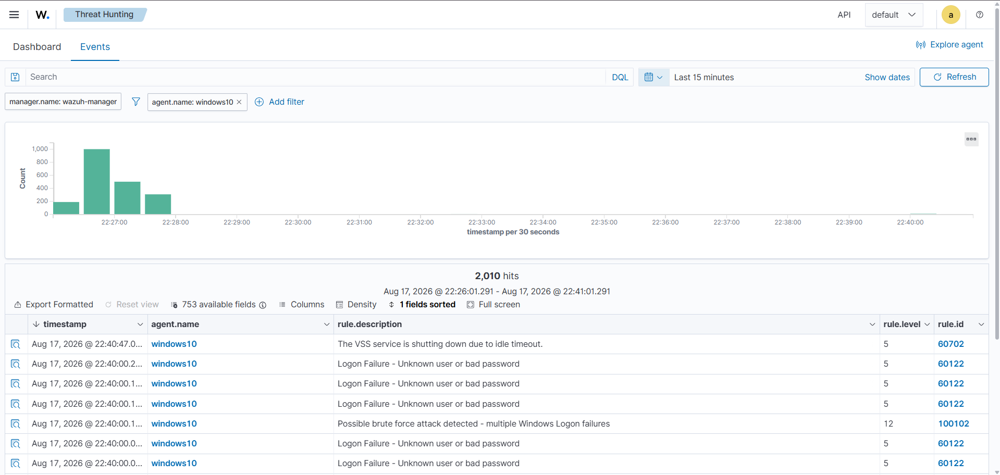

# 🛡️ Wazuh Windows Attack Detection Lab

A hands-on cybersecurity lab demonstrating how security activity on a Windows endpoint can be detected and investigated using Wazuh SIEM.

The lab uses Kali Linux for controlled security testing, Windows 10 as the monitored endpoint, and Wazuh for centralized security monitoring and alerting.

---

## 🎯 Project Objective

The goal of this project is to demonstrate a basic SOC detection workflow:

**Kali Linux → Windows 10 → Wazuh Agent → Wazuh Manager → Security Alert → Investigation**

The project demonstrates how Windows security events are collected, analyzed, correlated, and displayed in Wazuh.

---

## 🏗️ Lab Architecture

| System | Role | IP Address |
|---|---|---|
| Kali Linux | Security Testing Machine | 192.168.100.20 |
| Windows 10 | Monitored Endpoint | 192.168.100.30 |
| Wazuh Manager | SIEM / Detection Server | 192.168.100.10 |

### Tools Used

- Wazuh SIEM
- Wazuh Agent
- Kali Linux
- Windows 10
- VirtualBox
- Nmap
- Windows Event Logs
- PowerShell
- MITRE ATT&CK

---

# 🔍 Attack & Detection Scenarios

## 1. Network Scan Detection

A controlled network scan was performed from Kali Linux against the Windows endpoint.

### Testing

**Source:** Kali Linux — `192.168.100.20`

**Target:** Windows 10 — `192.168.100.30`

**Tool:** Nmap

The activity generated Windows network/security events which were collected by the Wazuh Agent.

### Wazuh Detection

**Rule ID:** `100101`

**Alert Level:** `10`

**Alert:** Possible network scan detected.

**MITRE ATT&CK:** T1046 — Network Service Discovery

This demonstrates how network reconnaissance activity can be detected through Windows events and Wazuh correlation.

---

## 2. Windows Authentication / Brute-Force Detection

Multiple failed Windows authentication attempts were generated in the controlled lab environment.

### Windows Event

**Event ID:** `4625`

Event ID 4625 represents a failed Windows logon attempt.

Wazuh detected the individual authentication failures as:

**Logon Failure - Unknown user or bad password**

After multiple failures, Wazuh correlated the events and generated:

**Possible brute force attack detected - multiple Windows Logon failures**

### Detection Details

**Rule ID:** `100102`

**Alert Level:** `12`

**Event ID:** `4625`

This demonstrates how a SIEM can correlate repeated authentication failures into a higher-severity security alert.

---

# 🔎 Event Investigation

Wazuh allowed individual events to be investigated using fields such as:

- Agent Name
- Agent IP
- Event ID
- Source Address
- Source Port
- Destination Address
- Destination Port
- Protocol
- Process ID
- Application
- Direction

### Example Network Event

**Source:** `192.168.100.20`

**Destination:** `192.168.100.30`

**Destination Port:** `135`

**Protocol:** TCP

**Direction:** Inbound

This information helps a SOC analyst understand the source, target, service, and nature of suspicious activity.

---

# 📊 Detection Summary

| Activity | Windows Evidence | Wazuh Detection | Level |
|---|---|---|---|
| Network Scan | Network Security Events | Possible network scan detected | 10 |
| Authentication Failure | Event ID 4625 | Logon Failure | 5 |
| Multiple Authentication Failures | Repeated Event ID 4625 | Possible brute force attack detected | 12 |

---

# 🧠 Key Learning Outcomes

Through this project, I gained practical experience in:

- Windows security event monitoring
- Wazuh SIEM configuration and alerting
- Network reconnaissance detection
- Authentication failure detection
- Event correlation
- Threat hunting
- MITRE ATT&CK mapping
- Basic SOC investigation workflow

---

## 📸 Evidence

### 1. Network Scan Detection

A network scan was performed from Kali Linux against the Windows endpoint.

**Kali Linux scan:**

**Wazuh detection:**

The activity was detected by Wazuh as a possible network scan and mapped to MITRE ATT&CK Network Service Discovery (T1046).

---

### 2. Windows Brute-Force Detection

Multiple failed Windows authentication attempts were generated in the controlled lab environment.

**Kali Linux activity:**

**Wazuh brute-force alert:**

Wazuh correlated the repeated authentication failures and generated a higher-severity brute-force detection alert.

**Event investigation:**

---

# 🔐 Security & Ethics

This project was performed in an isolated virtual lab for educational and authorized cybersecurity testing.

All security testing was conducted only against systems within the controlled lab environment.

Security testing should only be performed against systems for which explicit permission has been obtained.

---

# 👨‍💻 Author

## Sarvesh Khaladkar

IT / Cybersecurity Student

**Interests:** Blue Team • SOC Analysis • Threat Detection • Network Security • SIEM

---

⭐ This project demonstrates the practical workflow of generating security activity, collecting Windows events, detecting suspicious behavior with Wazuh, and investigating alerts from a SOC analyst perspective.
